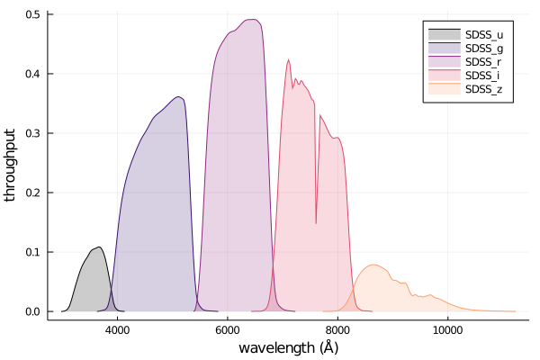

# PhotometricFilters

[](https://github.com/juliaastro/PhotometricFilters.jl/actions)
[](https://codecov.io/gh/juliaastro/PhotometricFilters.jl)
[](https://opensource.org/licenses/MIT)

[](https://juliaastro.org/PhotometricFilters/stable)
[](https://juliaastro.github.io/PhotometricFilters.jl/dev)

## Installation

This package is not yet registered. Ovne can install the most recent version from GitHub using 

```julia
import Pkg
Pkg.add(url="https://github.com/JuliaAstro/PhotometricFilters.jl.git")
```

## Usage

```julia
using PhotometricFilters
using PhotometricFilters: SDSS_u, SDSS_g, SDSS_r, SDSS_i, SDSS_z, fwhm

filts = [SDSS_u(), SDSS_g(), SDSS_r(), SDSS_i(), SDSS_z()]
```

plotting works out of the box

```julia
using Plots, ColorSchemes
plot(filts, palette=palette(:magma, 6), fill=(0, 0.2))
```



For more up-to-date and diverse sets of filter curves, you can query the [SVO Filter Profile Service](https://svo2.cab.inta-csic.es/theory/fps/) as shown in the example below for the Roman F146 filter.

```julia
using PhotometricFilters
svo_return = get_filter("Roman/WFI.F146");
filt = svo_return[1]
```

Using [Unitful.jl](https://github.com/painterqubits/Unitful.jl) is built in to all functionality

```julia

julia> filt_units = SDSS_u(units=true);

julia> fwhm(filt_units)
600.0 Å
```

## Citations
